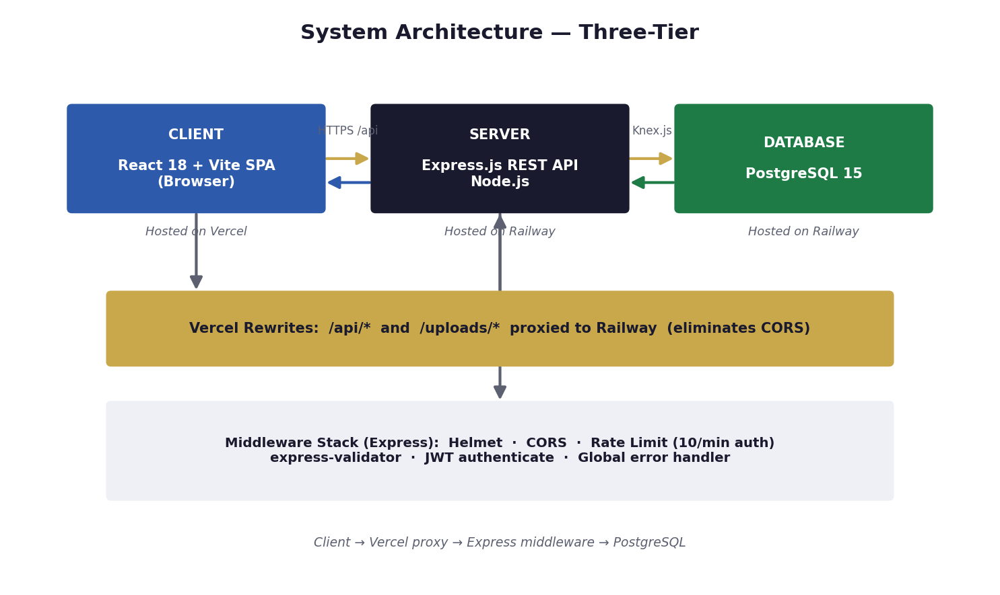
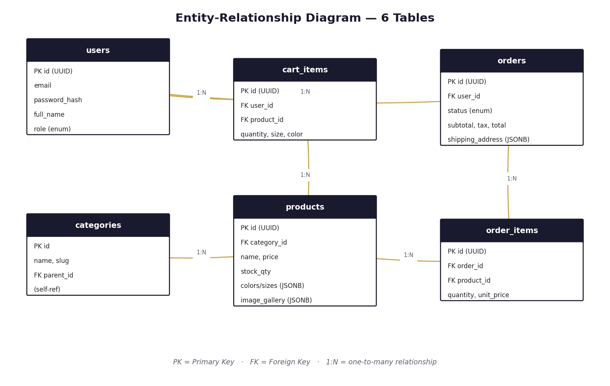
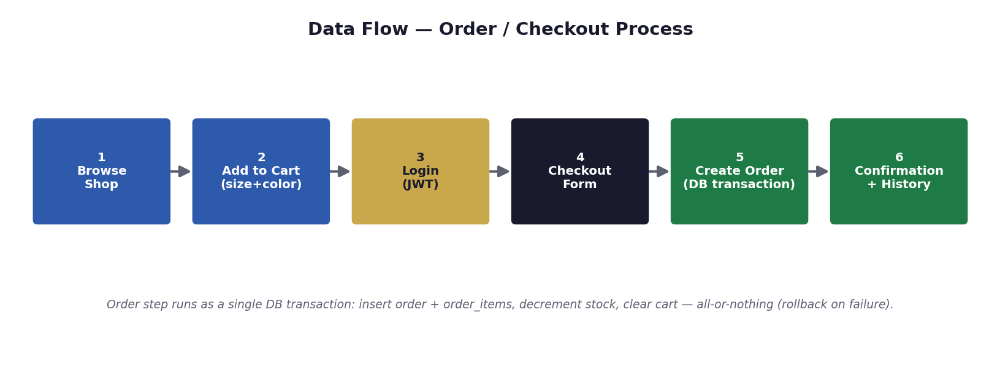

# Project Documentation — Aether Threads

This folder contains the technical documentation and diagrams for the
**Aether Threads** e-commerce platform.

## Contents

| File | Description |
|------|-------------|
| `Project_Documentation.docx` | Full project documentation report |
| `architecture.png` | System architecture diagram (3-tier) |
| `erd.png` | Entity-Relationship diagram (database schema) |
| `dataflow.png` | Data flow chart (order / checkout process) |

---

## 1. System Architecture



Three-tier architecture:
- **Client** — React 18 + Vite SPA, hosted on Vercel
- **Server** — Express.js REST API (Node.js), hosted on Railway
- **Database** — PostgreSQL 15, hosted on Railway

Vercel rewrites proxy all `/api/*` and `/uploads/*` requests to Railway,
eliminating CORS issues.

---

## 2. Entity-Relationship Diagram



6-table PostgreSQL schema: `users`, `categories`, `products`,
`cart_items`, `orders`, `order_items` — with all primary/foreign keys
and one-to-many relationships.

---

## 3. Data Flow — Order / Checkout



The checkout step runs as a single database transaction:
insert order + order_items, decrement stock, and clear the cart —
all-or-nothing with rollback on failure.

---

## Reproducing the Database

```bash
cd backend
npm install
npx knex migrate:latest   # creates all 6 tables
npx knex seed:run         # inserts 63 sample products
```

## Live Links

- **App:** https://aether-threads-7zmz.vercel.app
- **API:** https://aether-threads-production.up.railway.app
